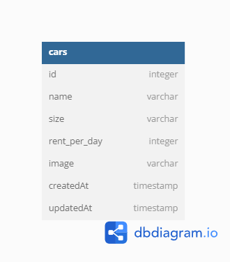

# f-fsw24001086-km6-nau-car-management-dashboard-ch4

# BCR - Car Management Dashboard // Challenge 4

aplikasi web express.js berguna untuk management data mobil dengan fungsi CRUD. Aplikasi disiapkan sebagai bagian dari challenge chapter 4, fullstack web development course di Binar Academy. Aplikasi ini menggunakan [desain dari figma](https://www.figma.com/file/BauisL5XNnbfGxqvvq6Bh9/BCR---Car-Management-Dashboard-(Copy)?node-id=18343%3A5831).

## Built With

- ExpressJS
- Sequelize
- Postgres

## Tabel database

 

# Getting Started

## Installation

### Clone the repo
   ```sh
   git clone https://github.com/naufaladysaputro/f-fsw24001086-km6-nau-car-management-dashboard-ch4.git
   ```

## Frontend Server
### Setup Server

    cd frontend
    npm install
    
`npm install` diperlukan untuk menginstall semua dependencies yang diperlukan dalam project.  
Apabila diperlukan backend api settings dapat diubah di `frontend/public/config/api.js`

### Running Server

    cd frontend
    npm start

Server frontend secara default akan berjalan di `http://localhost:3000/`  

### Server Routing
| Page | Route | Default Route |
|--|--|--|
| Homepage | `/` | http://localhost:3000/ |
| Add Car | `/add` | http://localhost:3000/add |
| Edit Car | `/edit?id={carId}` | http://localhost:3000/edit?id={carId} |
 
 
## Backend Server
### Setup Server

    cd backend
    npm install
    
`npm install` diperlukan untuk menginstall semua dependencies yang diperlukan dalam project.
    
Setelah itu pastikan [PostgreSQL](https://www.postgresql.org/download/) sudah ter-install dan berjalan di komputer. Kemudian setup file `backend/src/handler/db-handler/config/config.json` sesuai dengan settings database PostgreSQL yang sedang berjalan. Lanjut jalankan perintah berikut di terminal.

    cd backend/src/handler/db-handler
    sequelize db:create
    sequelize db:migrate
    
    // OPTIONAL: untuk menambahkan dummy data ke DB
    sequelize db:seed:all
    sequelize db:seed:undo // Untuk menghapus dummy data

Berikutnya setup aplikasi dengan akun [Cloudinary](https://cloudinary.com/) dilakukan dengan mengisi *api secrets* akun di file `backend/src/handler/cloudinary.js`

### Running Server

    cd backend
    npm start

Server frontend secara default akan berjalan di `http://localhost:4000/`  
